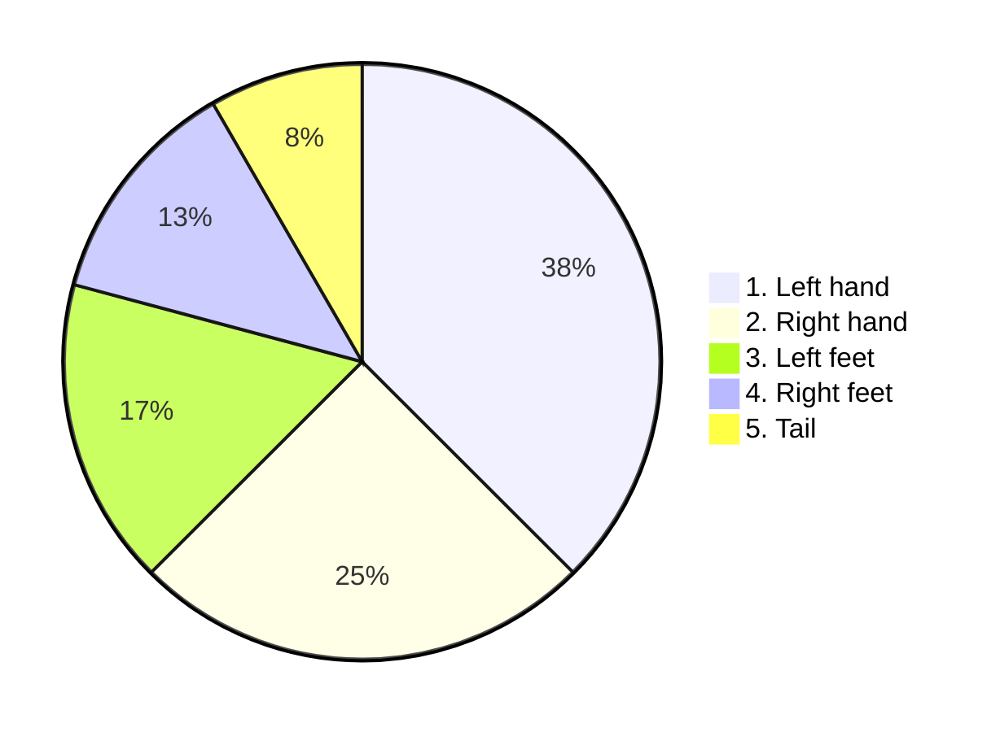

# DeepJS
DeepJS is standalone no OS functional javascript framework with deep learning engine to build abstract virtual machine, which support every feature using its natural language package.    
# 1. Virtual layer AI
It's running apps. They might be selfcreated or downloaded from store.
# 2. Top layer AI
Top layer of Deepjs AI based on precompiled calculations of the rating model. 
## animal template

# 3. Deep layer AI
On the deep, rating model can't calculate and verify the value, it's calculating time and building itself.
## Vertical sync pattern


---
```mermaid
pie
"page":100
   ```
---
---
---

# Getting started
1. Install DeepJS.
2. Complete test deep learning order.
3. Verify tree components of AI.
