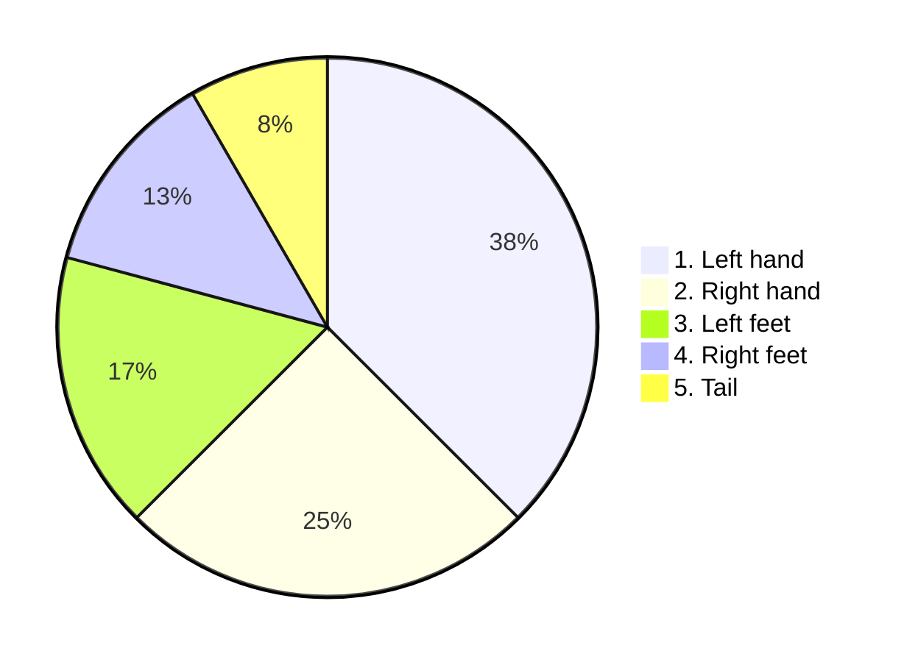

# DeepJS
DeepJS is standalone no OS functional javascript framework with deep learning engine to build abstract virtual machine, which support every feature.    

# DeepJS pattern
Deepjs based on static pizza rating power calculations


## Vertical sync
DeepJS form has vertical sync as [square] = 1FPS = [circle, line, tripple_line]:
{

---
```mermaid
pie
"page":100
   ```
---
---
---
}

# Getting started
1. Install DeepJS.
2. Complete test DL order.
3. Check form.
