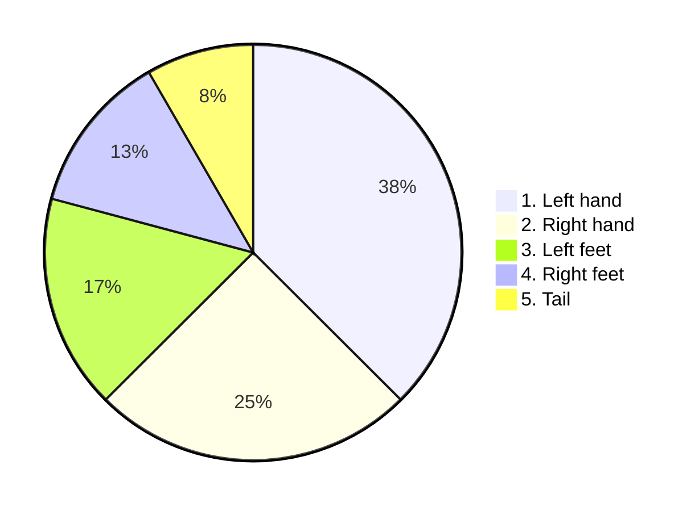

# DeepJS
DeepJS is standalone single function javascript framework with deep learning algorithm, which able to create web page from scratch using vertical sync.


# Virtual layer
DeepJS is able to build and run an application depends on the power of AI in general. It can use package shop or restore its core code with pushing new app on top.

# Update layer
DeepJS update layer based on nested string code compilation. This service can update the DeepJS application and proceed request-responce client-server communication request in JSON. 
       
    JSON{_{_{nested}, string{}}}

# Deep layer
DeepJS core layer service based on simple precompiled calculations from the past AI researches and can fast calculate the data.
## Animal rating model

## Vertical sync pattern
DeepJS perfomance can be setted by fixed FPS parameters and primary attributes like : tripple line, line, square, circle and coins

🪙🪙🪙

---
```mermaid
pie
"page":100
   ```
---
---
---

## Triangle texture pattern
DeepJS page can be generated from abstract trianle texture map in fixed coordinate polygon gradient with domain or ip watermark base.


# Getting started
1. Install DeepJS.
2. Learn it with your orders.
3. Verify AI components.
